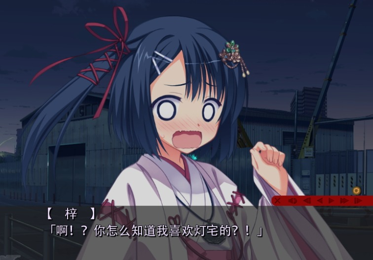

### KiriKiriZSM ~5.6 (Final?)
[](http://vnx.uvnworks.com)

A DLL Library tool to allow you write your own string editor or resouce manager in C#
Tested with: Nekopara Vol.0 & Vol.1, Dracu+Riot, Wagamama [Steam ver] (.scn, .pimg and .psb), TJS2100

### Any problem with my shit?
Try use this: https://github.com/UlyssesWu/FreeMote/tree/master/FreeMote.Tools.PsbDecompile

This tool is a proper PSB Editor, can help you with the .pimg, .psb, .scn too.


[Embedded Bitmap Tutorial](https://youtu.be/2OlgmNdK5UU)

[ZLIB LICENSE](https://raw.githubusercontent.com/marcussacana/KrKrZSceneManager/master/KrKrSceneManager/Zlib/license.txt)


---
# what I have change:
    - KrKrZSceneManager/ScnEditorGUI/Form1.cs
    
    content:
    
    Line 40:
    ```
        //增加到外部编辑器
                System.IO.File.AppendAllLines(@"H:\YUZUSOFT\scn.txt", SCN.Import());
    ```
    
    Line 81
    ```
    //狸猫换太子

                    string[] AimString = System.IO.File.ReadAllLines(@"H:\YUZUSOFT\scn.txt");
    ```
    
    - note: 直接在打开*.scn时输出到H:\YUZUSOFT\scn.txt，先不要退出，打开文本进行编辑（可以使用强大的正则），保存修改后文本后，程序中保存即可生成scn。
    

# 使用此程序进行机器翻译实用方法：

下载krkrextract工具

用它打开柚子社的游戏下的xp3文件，以dracu-riot为例
打开scn.xp3

选项为原版文件，解包出来
★プロローグa（始まり）.ks.scn

然后下载KrKrZSceneManager的项目，用visual stdio打开，ctrl+f5编译运行

在KrKrZSceneManager程序窗体空白处右键打开，选择★プロローグa（始まり）.ks.scn

根据改动的文本流重定向到H:\YUZUSOFT\scn.txt的原因，我们打开H:\YUZUSOFT\scn.txt
可以选用dr.eye这类汉化机器翻译（推荐），或者http://app.xunjiepdf.com/txtfanyi （不推荐）
原因是文本里有很多代码，如果机器翻译改变了这些源码，压包进入游戏就发生错误

我亲自测试了Dr.eye不会改变英文代码，比较安全

翻译之后覆盖保存进H:\YUZUSOFT\scn.txt

然后在KrKrZSceneManager工具中右键保存，即可得到被翻译好的★プロローグa（始まり）.ks.scn

然后用krkrextract封包就行了，放入游戏目录。


# 测试小改动最终效果如下：


    
